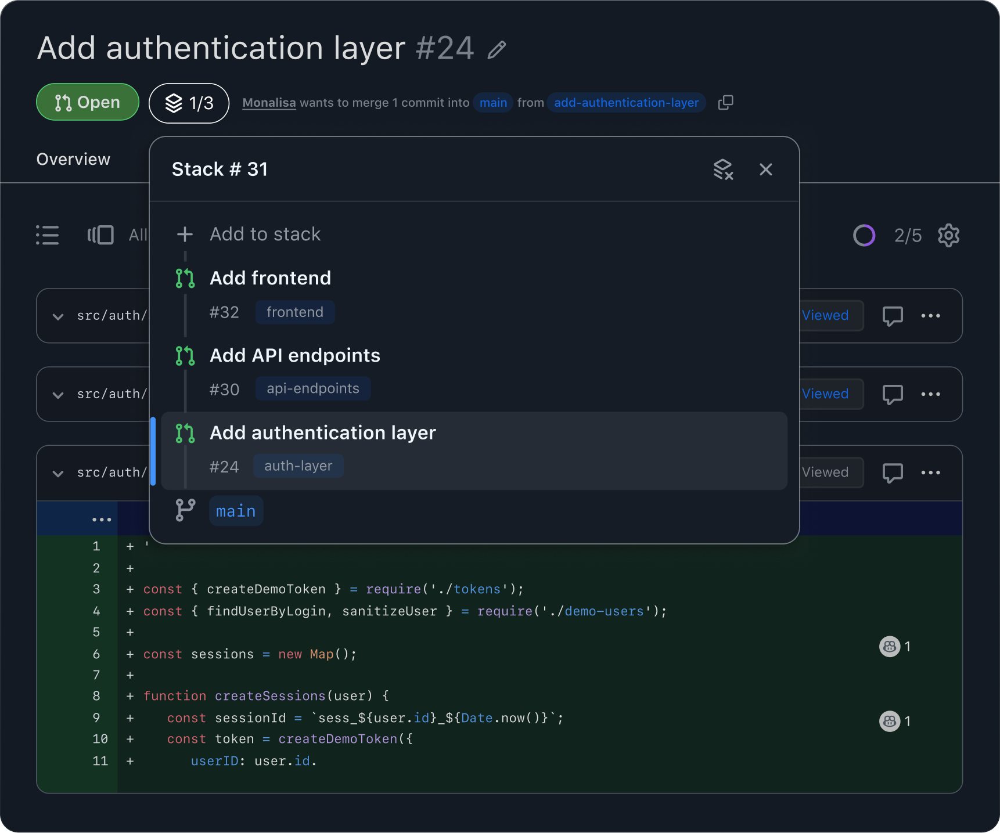
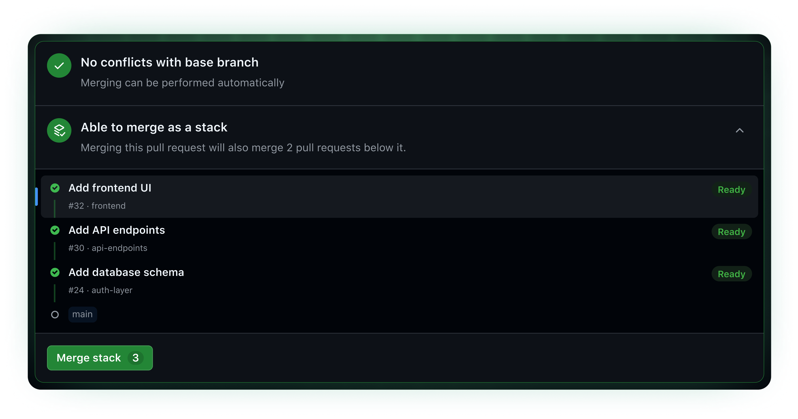

## Why Stacks?

For developers who want to break large changes into smaller, dependent parts, the experience can be painful:

- **Branch management** — Rebasing and keeping branches in sync across dependent PRs is tedious and error-prone.
- **Rules and CI** — Branch protection rules and CI checks often only trigger for the bottom PR in the chain, making it hard to know the true status of the rest.
- **Review context** — Reviewing a single change out of context from the rest of the stack can impact review quality.

## What Is a Stack?

A **pull request stack** consists of two or more pull requests in the same repository where:

- The **first (bottom) pull request** targets the stack's **trunk** — this can be any branch, and defaults to your repository's default branch (e.g., `main`).
- Each subsequent pull request targets the branch of the PR below it.

```
   ┌── feat/frontend     → PR #3 (base: feat/api-endpoints)  ← top
  ┌── feat/api-endpoints → PR #2 (base: feat/auth-layer)
 ┌── feat/auth-layer     → PR #1 (base: main)               ← bottom
main (trunk)
```

Each pull request in a stack:

- Represents an atomic, reviewable change (one or more commits).
- Can be reviewed and iterated on independently.
- Is evaluated for rules and protections using its **final target branch** (e.g., `main`), not the branch it directly targets.
- Can be merged directly or via merge queue, as long as the PRs below it are merged first (or at the same time).

## GitHub Stacked PRs

Stacked pull requests build on the existing pull request experience in GitHub, allowing authors to group a chain of individual PRs together as a stack. Together with the `gh stack` CLI, authors and reviewers can easily create, modify, navigate, and merge stacks.

### Stack Map in the PR UI

When a pull request is part of a stack, a **stack map** appears at the top of the PR page. It shows every PR in the stack, their status, and lets you navigate to any layer with one click. This gives reviewers immediate context about where a PR fits in the bigger picture.



### Rules and CI Enforcement

The merge requirements for any PR in the stack are determined by the **bottom PR's base** — typically `main`. This means:

- **Branch protection rules** like CODEOWNER approvals are enforced on every PR in the stack, even mid-stack PRs that don't directly target the trunk.
- **CI checks** triggered by pull requests targeting the trunk (e.g., `main`) run for all PRs in the stack, not just the bottom one.

This ensures that every layer of the stack meets the same quality bar before it can be merged.



### Merging Stacks

You can merge your entire stack, a single PR, or a portion of the stack spanning multiple PRs. When you click **Merge** on any PR, that PR and every unmerged PR below it are merged together, from the bottom up. So you can:

- **Land the entire stack in one click** by merging the top PR — every PR below it comes with it.
- **Land part of the stack** by merging a mid-stack PR — the PRs below it come along, and the PRs above stay open.

You can't merge a PR while leaving an unmerged PR below it behind. Merging a stacked PR always merges all the unmerged PRs below it as well.

GitHub supports two merge methods:

- **Direct merge** — The selected PR and all unmerged PRs below it land in a single **atomic** operation. Either the whole group merges, or if any part fails, nothing is merged and the operation is rolled back.
- **Merge queue** — The PRs enter the queue together and each PR is evaluated **individually**, from the bottom up. If a PR fails while in the queue, that PR and all its descendants are ejected from the queue, while prior PRs are unaffected. The queue makes a best-effort attempt to keep the whole stack in a single merge group; if the stack is too large to fit, it lands across consecutive groups. If PRs are split across merge groups, the stack order is preserved so downstack PRs are merged before upstack PRs.

In both methods, the resulting commit history is the same as if each PR had been merged individually, starting from the bottom.

:::note[Rule bypass & auto-merge currently unsupported]
Rule bypass and auto-merge functionality are coming soon, but currently unavailable for stacked PR merges. A stack merge can only be triggered once all selected PRs meet their requirements. See the [FAQ](/gh-stack/faq/#can-i-bypass-the-rules-to-merge-a-stacked-pr) for details.
:::

### Merge Methods

Stacks support all three merge methods:

- **Merge commit** — Creates one merge commit for the entire group of changes being merged. The full commit history of each PR is preserved.
- **Squash merge** — Creates one clean, squashed commit per PR. Each PR's commits are combined into a single commit on the target branch.
- **Rebase merge** — Replays all commits from each PR onto the base branch, creating a linear history without merge commits.

### Simplified Rebasing

Rebasing is the trickiest part of working with Stacked PRs, and GitHub handles it automatically:

- **In the PR UI** — A **Rebase Stack** button lets you trigger a server-side cascading rebase. It rebases the entire stack on top of the latest trunk, updates every unmerged branch, and force-pushes the results. See [Rebasing from the UI](/gh-stack/guides/ui/#rebasing-from-the-ui) for details.
- **From the CLI** — `gh stack rebase` performs the same cascading rebase locally.
- **After partial merges** — When you merge a PR at the bottom of the stack, the remaining branches are automatically rebased so the next PR targets the trunk and is ready for review and merge.
- **Safe squash-merge handling** — Squash merges are fully supported. The rebase engine safely replays your unique commits on top of the squashed base, avoiding artificial merge conflicts. See the [FAQ](/gh-stack/faq/#how-does-squash-merge-work) for a detailed description of how this works.

## The CLI: `gh stack`

While the PR UI provides the review and merge experience, the `gh stack` CLI handles the local development workflow:

- **Creating branches** — `gh stack init` and `gh stack add` create and track branches in the correct dependency order.
- **Keeping branches rebased** — `gh stack rebase` cascades changes through the stack, handling both regular and squash-merged PRs.
- **Pushing branches** — `gh stack push` pushes all branches to the remote.
- **Creating PRs** — `gh stack submit` pushes branches and creates or updates PRs, linking them as a Stack on GitHub.
- **Navigating the stack** — `gh stack up`, `down`, `top`, and `bottom` let you move between layers without remembering branch names.
- **Syncing everything** — `gh stack sync` fetches, rebases, pushes, updates PR state, and links open PRs into a Stack on GitHub in one command. It also syncs the stack's remote state, pulling down branches for any PRs added to the stack on GitHub.
- **Restructuring stacks** — `gh stack modify` opens an interactive terminal UI to drop, fold, insert, rename, and reorder branches in a stack.
- **Tearing down stacks** — `gh stack unstack` removes a stack from GitHub and local tracking.
- **Checking out a stack** — `gh stack checkout` pulls a stack, with all its branches, down from GitHub to your local machine. Give it a stack number or run it with no arguments to pick from an interactive list of every stack available to you (local and remote).

The CLI is not required to use Stacked PRs — the underlying git operations are standard. But it makes the workflow simpler, and you can create Stacked PRs from the CLI instead of the UI.

**Bring Your Own Tools:** You don't need to use the `gh stack` CLI for your local workflow. If you use tools like Jujutsu, Sapling, or custom tools to manage and push your local branches, you can then use the CLI or the GitHub UI to open a stack of PRs from those branches. See the [FAQ](/gh-stack/faq/#will-this-work-with-a-different-tool-for-stacking) for examples.

## Thinking About Stack Structure

Each branch in a stack should represent a **discrete, logical unit of work** that can be reviewed independently. Think of a stack from the reviewer's perspective: the PRs should tell a cohesive story, where each one is a small, logical piece of the whole.

### Dependency Chain

Stacked branches form a dependency chain: each branch builds on the one below it. This means foundational changes (models, shared types, database schema) go in lower branches, and code that depends on them (API routes, UI components) goes in higher branches.

```
   ┌── feat/frontend-ui  ← UI components that call the APIs
  ┌── feat/api-endpoints ← API routes that use the models
 ┌── feat/data-models    ← shared types, database schema
main (trunk)
```

The key principle: if code in one layer depends on code in another, the dependency must be in the same branch or a lower one.

### When to Create a New Branch

Create a new branch when you're starting a different concern that depends on what you've built so far:

- You're switching from backend to frontend work
- You're moving from core logic to tests or documentation
- The next set of changes has a different reviewer audience
- The current branch's PR is already large enough to review

## Next Steps

- [Quick Start](/gh-stack/getting-started/quick-start/) — Install the CLI and create your first stack
- [Working with Stacked PRs](/gh-stack/guides/stacked-prs/) — Learn about the PR review and merge experience
- [Typical Workflows](/gh-stack/guides/workflows/) — Common patterns for day-to-day use
- [CLI Reference](/gh-stack/reference/cli/) — Complete command documentation
